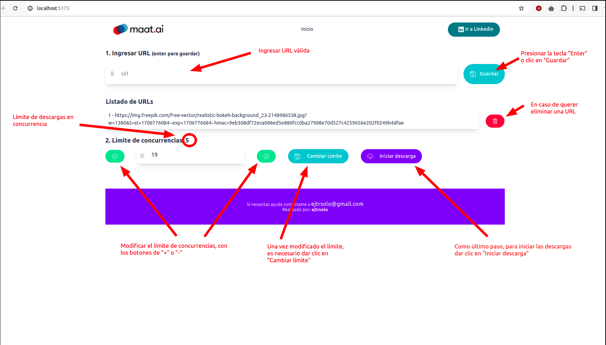
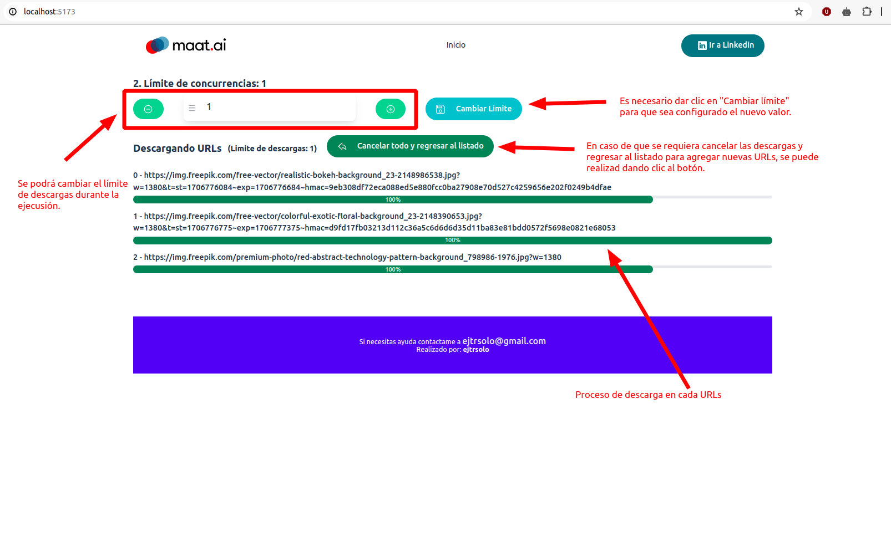

# Frontend para aplicación de descarga de archivos en concurrencia

## Instrucciones de uso

1. > Al entrar en la pantalla principal, veremos algo como lo siguiente:

1.1 Primero debemos ingresar una URL válida, en el campo "URL". En caso de que sea inválida, el sistema nos informará con un mensaje debajo del campo. 

1.2 Para agregar la URL, podemos presionar la tecla "Enter" o darle clic al botón "Guardar". Y así hasta agregar todas las URLs que se necesiten.

1.3 Después podemos configurar el límite de descargas en concurrencia. Por default se muestra en 5, pero podemos cambiarlo con los botones de "+" o de "-" para bajar o subir el límite. Una vez configurado, es necesario darle clic a "Guardar límite". Este paso puede modificarse cuando se inician las descargas.

1.4 También tenemos la opción de borrar las URLs que no queramos desde el listado, solo con darle clic al ícono "Rojo" de la "Basura".

1.5 Una vez configurado lo anterior. Podemos darle clic a "Iniciar descargas" para que comience el proceso de descarga concurrente de archivos.

2. > Al darle clic al botón "Iniciar descargas", se mostrará un listado donde debajo de cada una de las URLs tendrá un marcador de progreso de la descarga (solo las que se están descargando lo tendrán, las demás conforme se completen unas para tener espacio para las otras, se irán mostrando las barras de progreso). Se puede ver un poco mejor en la siguiente imagen:

2.1 Una vez iniciadas las descargas, solo podemos cambiar el límite de concurrencias como lo muestra en el paso 1.3. En caso de querer subir el límite y si hay descargas pendientes, las descargas faltantes se iniciarán después de guardado el límite. En caso de querer bajarlo, no se verá reflejado en el momento, hasta que se terminen las descargas en proceso y después ya solo se estarán descargando conforme al límite configurado.

2.2. Aquí también podremos cancelar todas las descargas y volver a regresar al listado para editarlo o realizar lo que se necesite conforme a los pasos del punto 1. Para esto es necesario dar clic en el botón "Cancelar todo y regresar al listado". Una vez dado clic, puede seguir los pasos del punto 1 para continuar.

    **NOTA:** Cuando se agregan URLs de archivos no tan pesados, la barra de progreso puede dar un salto de 0 a 100 en un paso, ya que se buscan actualizaciones al servidor cada **4 segundos**. Para poder ver la barra de progreso que se mueva un poco más lento, recomiendo agregar URLs de archivos con tamaño mayor a 50MB, aunque dependendo del internet, esto puede ser un paso muy rápido o muy lento. Puedes ir revisando con archivos más grandes o más chicos dependiendo de tu computadora y velocidad de conexión a internet.